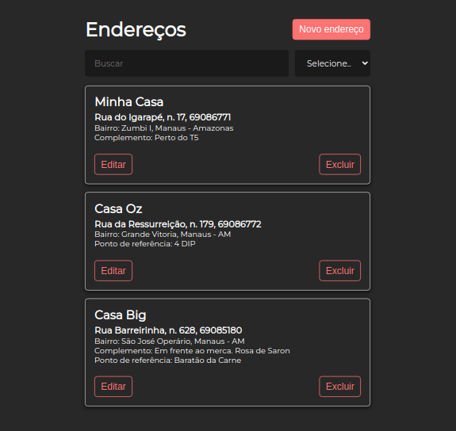

# Via CEP Challenge

Projeto pessoal de gerenciamento de endereços (CRUD).

## Tecnologias
- [x] ReactJS
- [x] JSON-Server (Fake API)
- [x] Consumo da API [Via CEP](https://github.com/viniciussanchez/viacep) 

## Instruções

### execute api
Abre a pasta api/ e digite:

`yarn`
`yarn start`

### execute o projeto
No raíz do repositório, execute:

`yarn`
`yarn start`

Abra [http://localhost:3000](http://localhost:3000) no navegador

### projeto

<h1 align='center'>
  
</h1>
